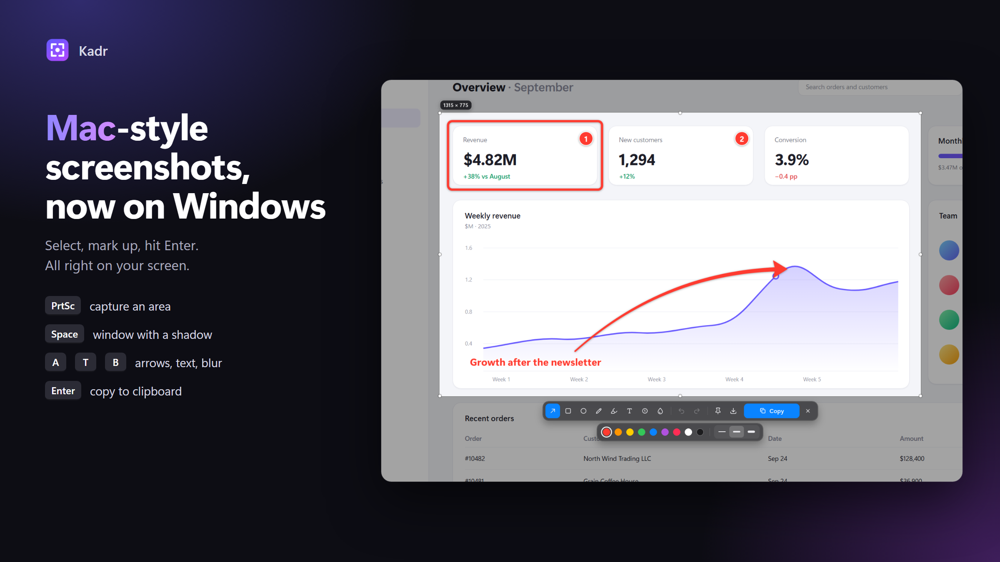
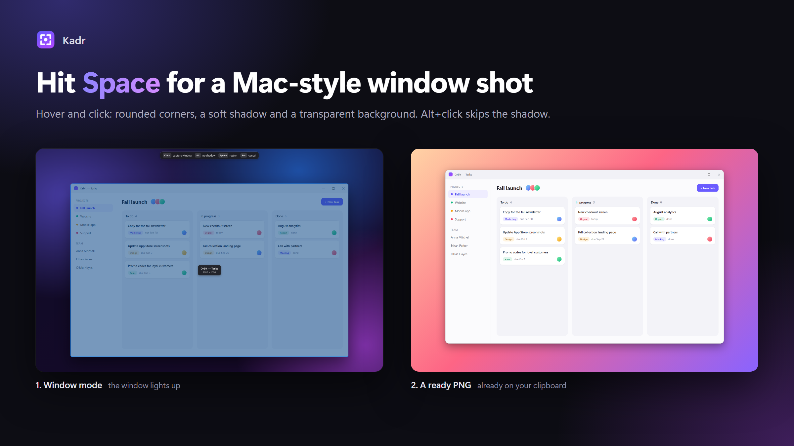
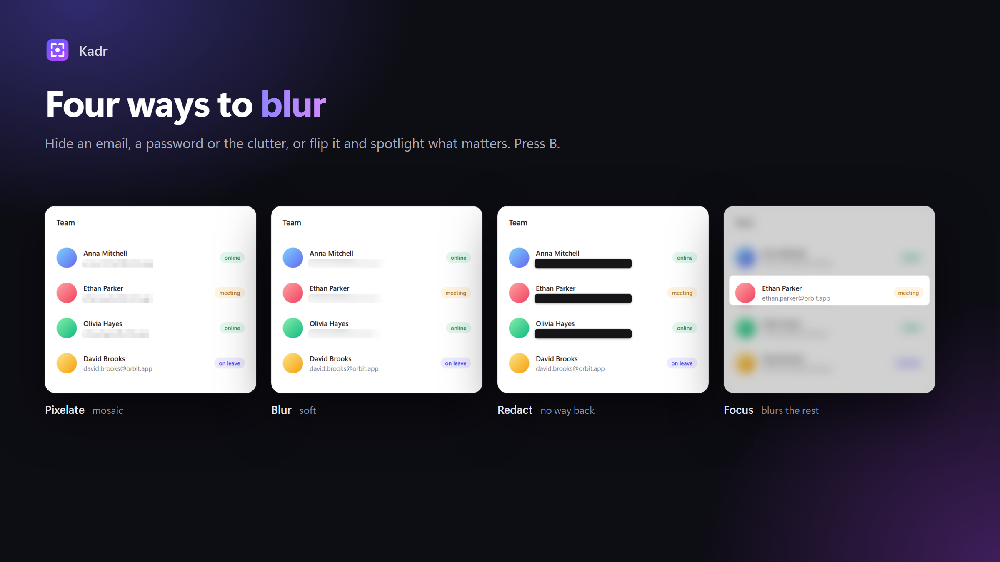
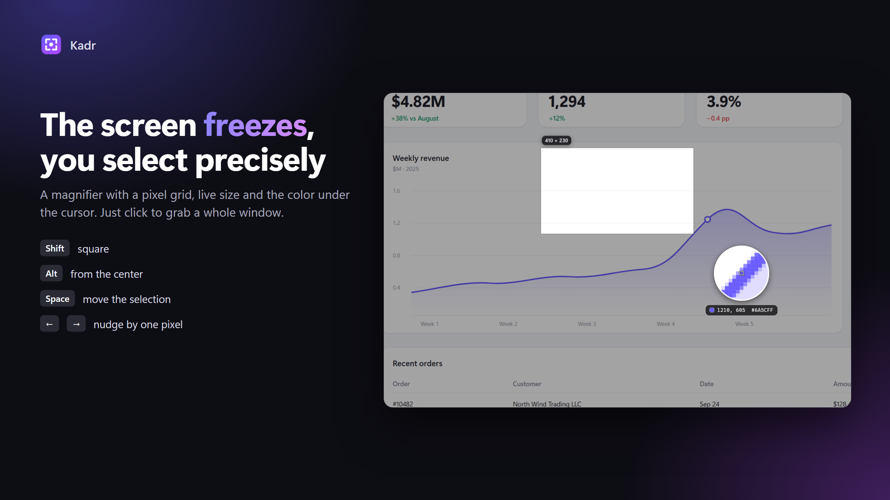
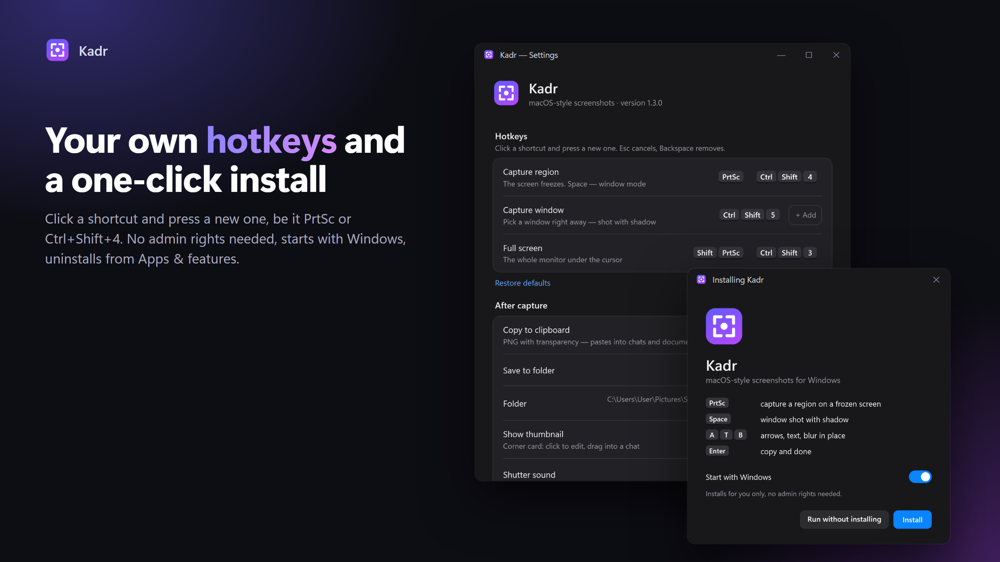

# Kadr — macOS-style screenshots for Windows

**English** · [Русский](README.ru.md)



Press **PrtSc** and the screen freezes. Select an area, draw an arrow, type a note, press **Enter**, and the image is already on your clipboard. No separate editor window, no extra clicks. If you miss `Cmd+Shift+4` from macOS, this is it for Windows.

**[⬇ Download Kadr.exe](https://github.com/skybots-tg/kadr/releases/latest/download/Kadr.exe)** · Windows 10/11 (x64) · free, open source, no ads, works offline

---

## Features

- **Region capture on a frozen screen** with a magnifier loupe that shows the pixel grid, coordinates and color. `Shift` locks a square, `Alt` draws from the center, `Space` while selecting moves the frame, arrow keys nudge by one pixel. A click without dragging selects the window under the cursor.
- **macOS-style window screenshots.** Press `Space`, hover a window and click: rounded corners, soft drop shadow, transparent background. `Alt+click` captures without the shadow.
- **Annotate in place:** arrows (drag the midpoint to curve them), rectangles, ellipses, pen, highlighter, text in three styles, numbered step counters. Every mark can be selected, moved and recolored. `Ctrl+Z` / `Ctrl+Y`.
- **Four ways to hide things:** pixelate, blur, solid redaction box and "focus" (blur everything around the area).
- **Floating thumbnail** after each shot: click to edit, drag the file straight into Telegram, Slack, a browser or Explorer, swipe right to dismiss.
- **Pin to screen** (`Ctrl+P`): keep a screenshot on top of all windows; mouse wheel zooms, `Ctrl+wheel` changes opacity.
- **English and Russian interface.** The language follows Windows and can be switched in the settings.
- **Custom hotkeys**, autostart and save folder in the settings.
- **Updates itself** from GitHub releases, quietly, when you are not taking a screenshot (can be turned off).









## Hotkeys

| Keys | Action |
|---|---|
| `PrtSc`, `Ctrl+Shift+4` | Capture a region |
| `Ctrl+Shift+5` | Capture a window |
| `Shift+PrtSc`, `Ctrl+Shift+3` | Full screen (the monitor under the cursor) |
| `Space` | Before selecting: window mode; while selecting: move the frame |
| `A` `R` `O` `P` `H` `T` `N` `B` | Arrow, rectangle, oval, pen, highlighter, text, counter, blur |
| `1`–`9`, `[` `]` | Color, stroke width |
| `Enter` / `Ctrl+C` | Copy and close |
| `Ctrl+S` · `Ctrl+P` · `Esc` | Save as… · pin · cancel |

Capture hotkeys can be changed in the settings (tray icon → Settings…).

## Install

1. Download [`Kadr.exe`](https://github.com/skybots-tg/kadr/releases/latest/download/Kadr.exe) and run it.
2. Click **Install**. Kadr installs for the current user only (no admin rights needed) and adds itself to the Start menu and autostart.
3. Press `PrtSc`.

Windows SmartScreen may say "Windows protected your PC" because the app has no paid code-signing certificate. Click **More info → Run anyway**.

Prefer a portable app? The **Run without installing** button runs Kadr straight from the downloaded file.

**Uninstall:** Settings → Apps → Kadr → Uninstall (or from Kadr's own settings). Your screenshots are kept.

## Where screenshots go

To the clipboard (PNG with transparency, pastes into messengers and documents) and to `Pictures\Screenshots`, named like `Screenshot 2026-09-26 at 14.32.10.png`. Everything is configurable. Kadr works fully offline and sends nothing anywhere.

## Build from source

Requires the [.NET 8 SDK](https://dotnet.microsoft.com/download/dotnet/8.0) (WPF).

```
dotnet build -c Release
dotnet publish -c Release -r win-x64 --self-contained true -p:PublishSingleFile=true -p:IncludeNativeLibrariesForSelfExtract=true -p:EnableCompressionInSingleFile=true -o dist
```

The README images are generated by `python promo/build.py`: it renders demo pages from `promo/src` and draws Kadr's real interface on top of them (`Kadr.exe --promo`).

## License

MIT. Icons are hand-drawn in the style of [Lucide](https://lucide.dev) (ISC).
