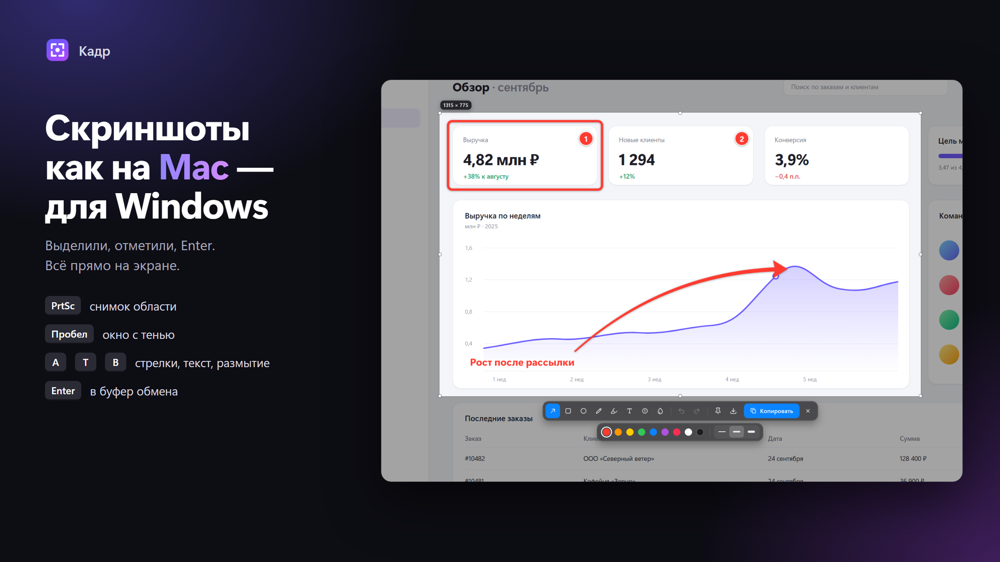
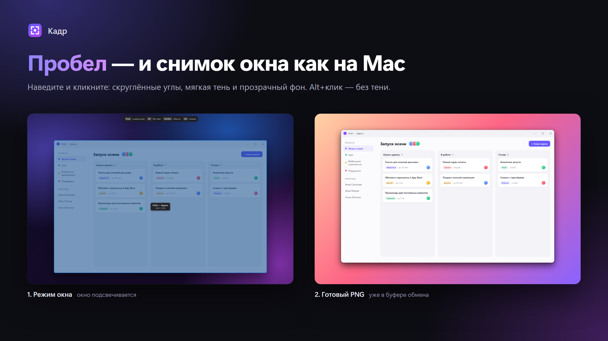
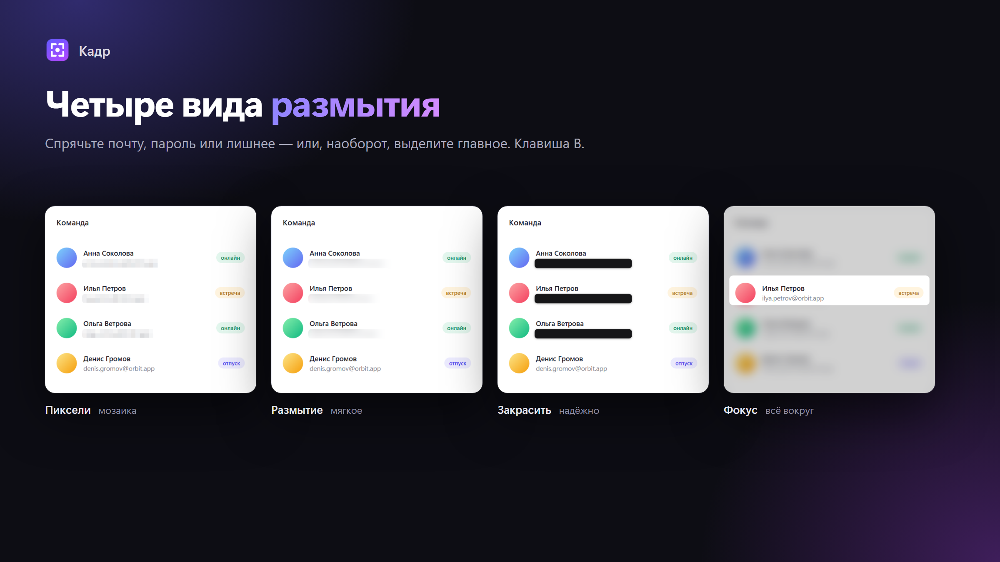
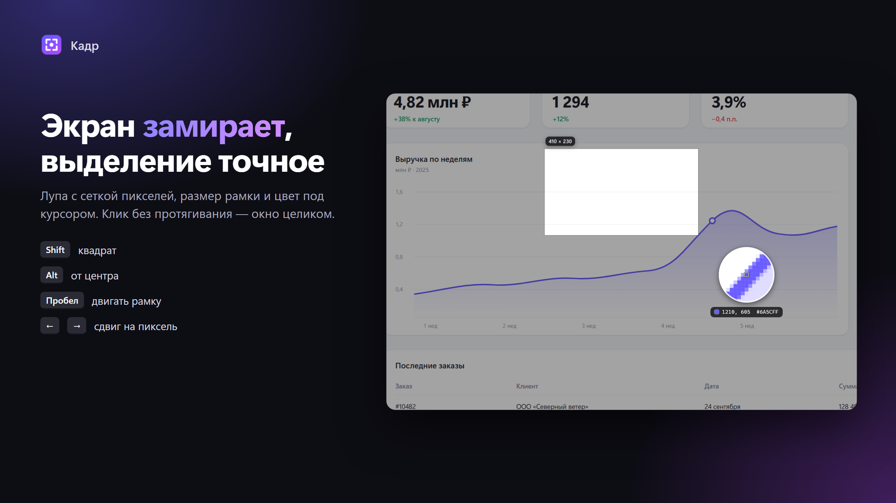
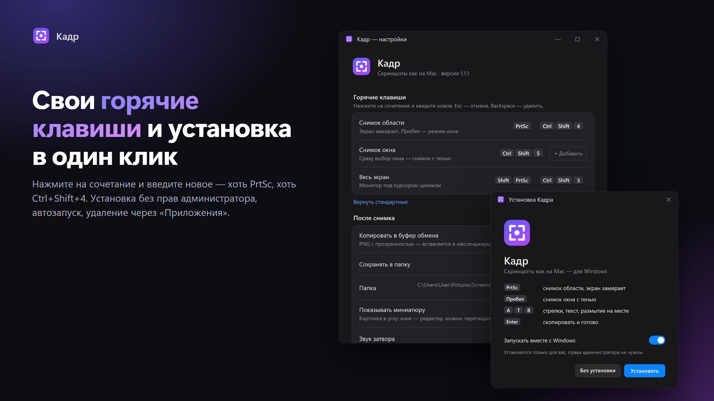

# Кадр — скриншоты как на Mac, для Windows

[English](README.md) · **Русский**



Нажали **PrtSc** — экран замер. Выделили область, поставили стрелку, написали текст, нажали **Enter** — картинка уже в буфере обмена. Без отдельных окон редактора и без лишних кликов.

**[⬇ Скачать Кадр.exe](https://github.com/skybots-tg/kadr/releases/latest/download/Kadr.exe)** · Windows 10/11 (x64) · бесплатно и без рекламы

---

## Что умеет

- **Снимок области** — экран «замораживается», у курсора лупа с сеткой пикселей, координатами и цветом. `Shift` — квадрат, `Alt` — от центра, `Пробел` во время выделения двигает рамку, стрелки — сдвиг на пиксель. Клик без протягивания выделяет окно под курсором.
- **Снимок окна как на Mac** — нажмите `Пробел`, наведите на окно и кликните: скруглённые углы, мягкая тень и прозрачный фон. `Alt+клик` — без тени.
- **Разметка прямо на месте** — стрелки (тяните среднюю точку, чтобы изогнуть), прямоугольники, овалы, карандаш, маркер, текст в трёх стилях, нумерация шагов. Любую пометку можно выделить, передвинуть, поменять цвет. `Ctrl+Z` / `Ctrl+Y`.
- **Четыре вида размытия** — пиксели, мягкое размытие, сплошная плашка и «фокус» (размыть всё вокруг).
- **Миниатюра в углу** после снимка: клик — редактор, можно перетащить файл прямо в Telegram, браузер или проводник, смахнуть вправо — убрать.
- **Закрепить поверх окон** (`Ctrl+P`) — снимок висит над всеми окнами; колесо — масштаб, `Ctrl+колесо` — прозрачность.
- **Свои горячие клавиши**, автозапуск, выбор папки — в настройках.
- **Обновляется сам** — новые версии с GitHub ставятся тихо, когда вы не делаете снимок (можно отключить или проверить вручную в настройках).









## Горячие клавиши

| Клавиши | Действие |
|---|---|
| `PrtSc`, `Ctrl+Shift+4` | Снимок области |
| `Ctrl+Shift+5` | Снимок окна |
| `Shift+PrtSc`, `Ctrl+Shift+3` | Весь экран (монитор под курсором) |
| `Пробел` | До выделения — режим окна, во время — двигать рамку |
| `A` `R` `O` `P` `H` `T` `N` `B` | Стрелка, прямоугольник, овал, карандаш, маркер, текст, нумерация, размытие |
| `1`–`9`, `[` `]` | Цвет, толщина |
| `Enter` / `Ctrl+C` | Скопировать и закрыть |
| `Ctrl+S` · `Ctrl+P` · `Esc` | Сохранить как… · закрепить · отмена |

Сочетания для снимков меняются в настройках (иконка в трее → «Настройки…»).

## Установка

1. Скачайте [`Kadr.exe`](https://github.com/skybots-tg/kadr/releases/latest/download/Kadr.exe) и запустите.
2. Нажмите **«Установить»** — Кадр установится только для вас (права администратора не нужны), добавится в «Пуск» и в автозапуск.
3. Нажмите `PrtSc`.

Windows может показать «Система Windows защитила ваш компьютер» — это из-за того, что у приложения нет платной цифровой подписи. Нажмите **«Подробнее» → «Выполнить в любом случае»**.

Можно и без установки: кнопка «Без установки» запускает Кадр прямо из скачанного файла.

**Удаление:** «Параметры» → «Приложения» → «Кадр» → «Удалить» (или в настройках Кадра). Ваши снимки при этом не удаляются.

## Куда попадают снимки

В буфер обмена (PNG с прозрачностью — вставляется в мессенджеры и документы) и в папку `Картинки\Screenshots` с именами вида `Снимок экрана 2026-09-26 в 14.32.10.png`. Всё настраивается. Кадр работает полностью офлайн и ничего никуда не отправляет.

## Сборка из исходников

Нужен [.NET 8 SDK](https://dotnet.microsoft.com/download/dotnet/8.0).

```
dotnet build -c Release
dotnet publish -c Release -r win-x64 --self-contained true -p:PublishSingleFile=true -p:IncludeNativeLibrariesForSelfExtract=true -p:EnableCompressionInSingleFile=true -o dist
```

Картинки для README собираются скриптом `python promo/build.py`: он рендерит демо-страницы из `promo/src` и рисует поверх них настоящий интерфейс Кадра (`Kadr.exe --promo`).

